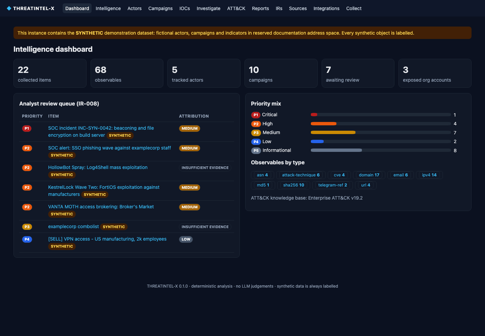
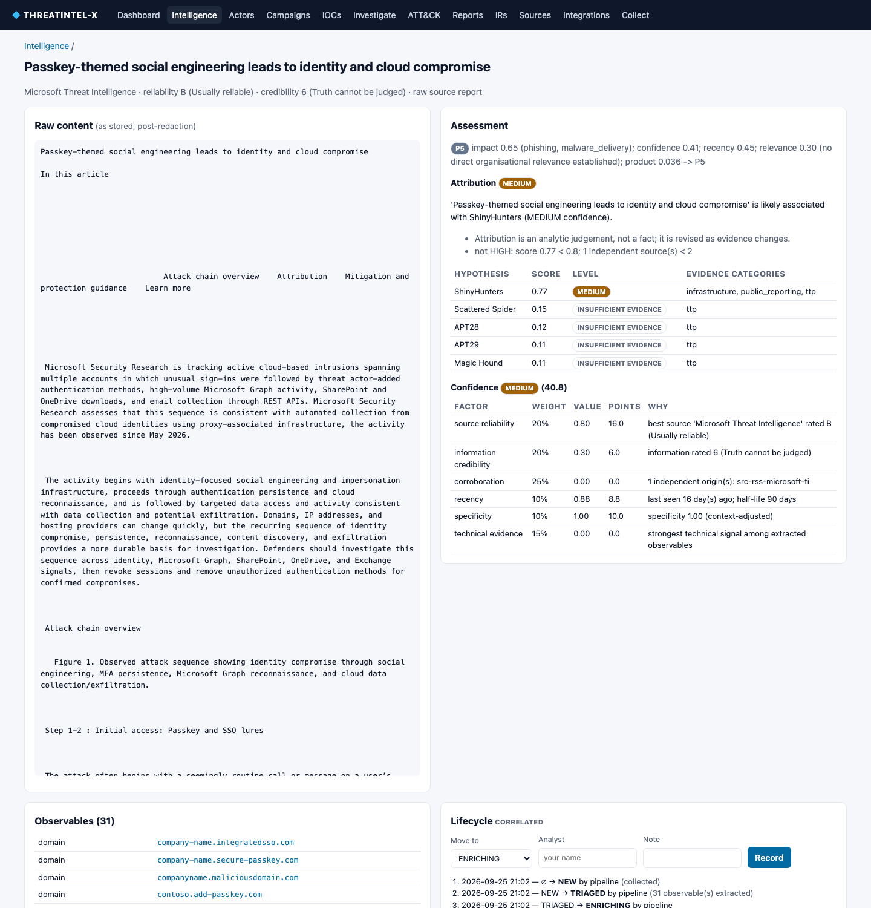
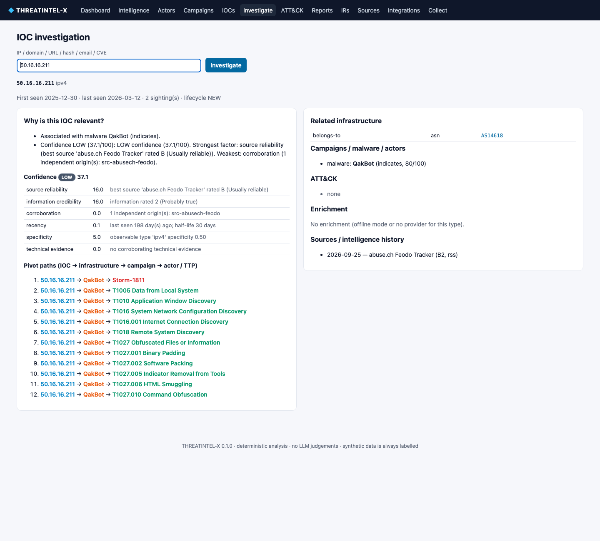
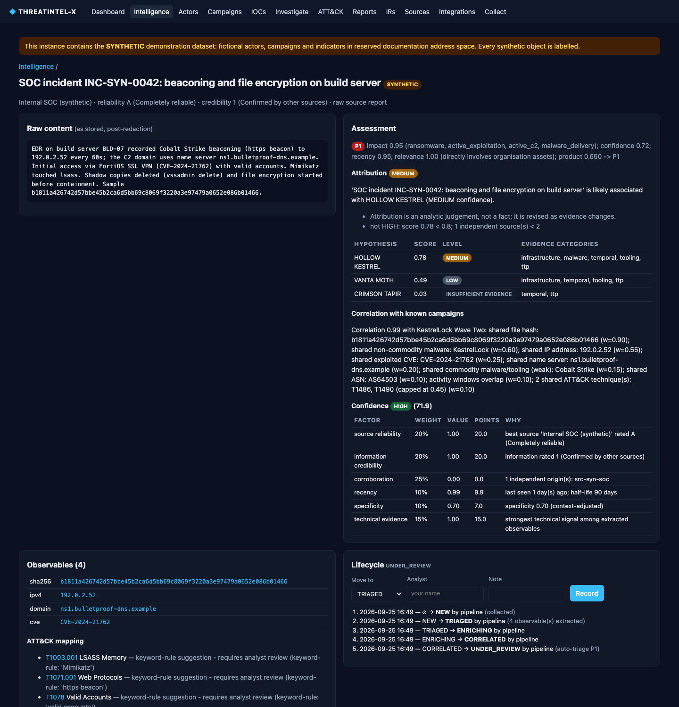
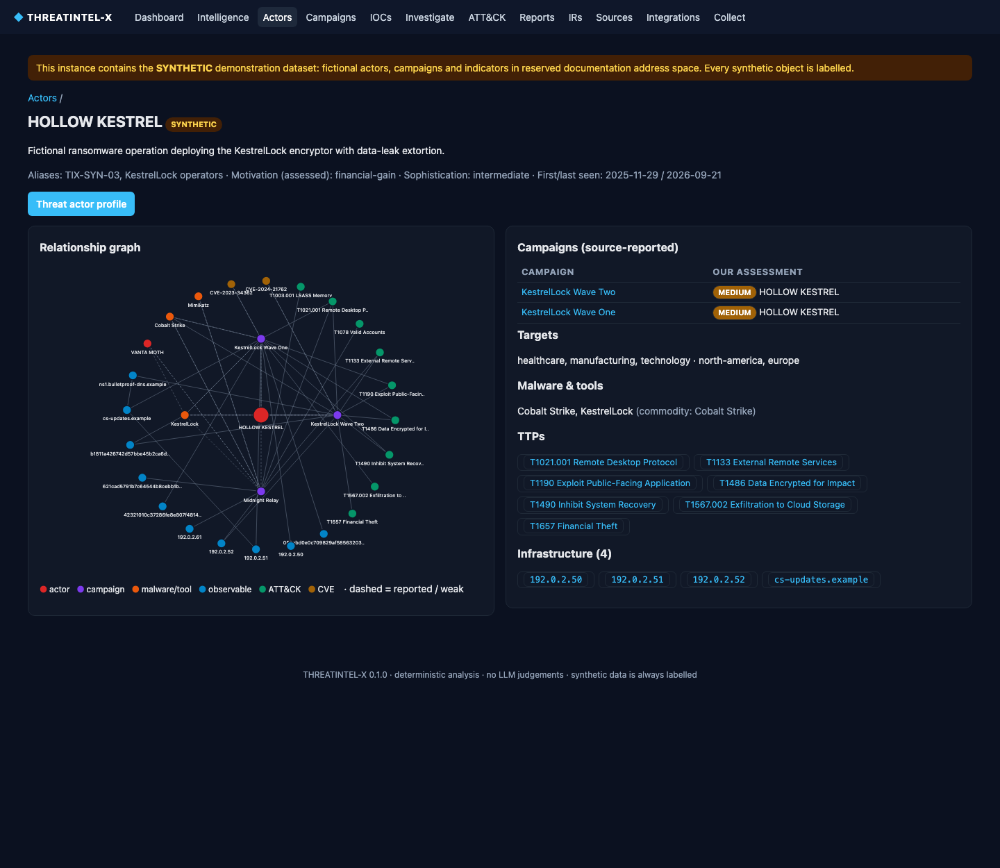
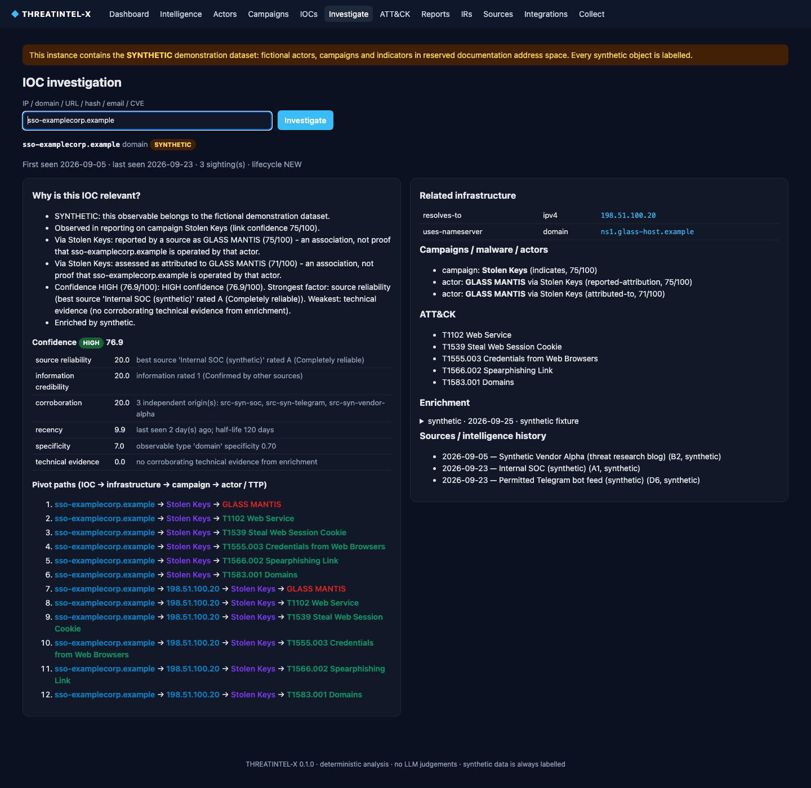
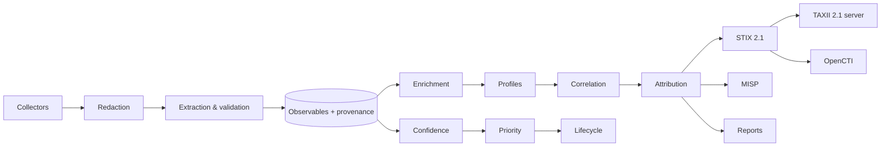

# THREATINTEL-X

**Evidence-first Cyber Threat Intelligence platform** — collection, IOC lifecycle, enrichment,
correlation, competing-hypothesis attribution, MITRE ATT&CK, STIX 2.1, TAXII 2.1, MISP and OpenCTI —
with every judgement explained, every object traceable to its source, and no LLM in the decision path.

[](https://github.com/kakarot6911/threatintel-x/actions/workflows/ci.yml)


> Two modes, two databases: a **synthetic demo world** (fictional, labelled at every layer, in reserved
> documentation address space) and a **real-data mode** that ingests MITRE ATT&CK, CISA KEV, abuse.ch and
> public threat-research feeds.



## Why this exists
Most "threat intel dashboards" stop at *IOC matched a feed*. Real CTI work is about **how much you
should believe something and why**: who said it, whether the sources are actually independent, what
evidence links an intrusion to an actor, which alternative explanations remain, and what the business
should do. THREATINTEL-X implements that reasoning as deterministic, tested code.

## What it does
| Stage | Highlights |
|---|---|
| **Collect** | RSS/Atom, STIX bundles, TAXII 2.1, MISP, Telegram **Bot API only** (allow-listed chats), HUMINT-style intake, ATT&CK sync, synthetic world |
| **Protect** | Secrets (combolists, API keys, JWTs, private keys…) **redacted before storage**; only the account and the *fact* of exposure are kept |
| **Extract** | Defang-aware IOCs (IPv4/6, domains, URLs, emails, hashes, CVEs, ATT&CK ids, BTC with checksum, ETH, Telegram), alias-based entity recognition, file-name false-positive rejection |
| **Validate** | IANA TLDs, routability, documentation ranges, empty-file hashes, unknown ATT&CK ids, staleness |
| **Enrich** | RDAP, DNS, Team Cymru ASN, VirusTotal, URLScan, AbuseIPDB, Shodan, Censys — cached, rate-limited, retried, **never fabricated** on failure; offline by default |
| **Correlate** | Noisy-OR over shared hashes/infra/certs/malware/TTPs with capped weak signals and per-signal explanations |
| **Attribute** | Every candidate actor scored; hard gates (single category ≤ LOW, HIGH needs ≥ 3 categories + ≥ 2 independent sources); contested hypotheses downgraded; vendor *claims* kept separate from *our* assessment |
| **Assess** | Admiralty reliability (A–F) and credibility (1–6) scored separately; 6-factor confidence; P1–P5 priority; lifecycle with human-only confirmation |
| **Disseminate** | Validated STIX 2.1 export/import, built-in **TAXII 2.1 server**, MISP events with native taxonomies/galaxies, OpenCTI push, 5 report types, IR answers |

## Quick start
```bash
git clone https://github.com/kakarot6911/threatintel-x && cd threatintel-x
make install                      # Python 3.12 venv via uv (or: pip install -e ".[dev]")
.venv/bin/threatintel demo        # seed + process the synthetic world (~2 s)
.venv/bin/threatintel serve       # prints an ephemeral API key → http://127.0.0.1:8000
```
Log in with any username and the printed key as password. Walkthrough: [docs/DEMO.md](docs/DEMO.md).

Docker: `cp .env.example .env` (set `TIX_API_KEY`), then `docker compose up --build`.

### CLI
```bash
threatintel ingest report.txt --reliability B --credibility 2   # analyst intake
threatintel collect-rss "CISA" --url https://www.cisa.gov/cybersecurity-advisories/all.xml  # needs TIX_ONLINE=true
threatintel investigate 192.0.2.52
threatintel report technical-report --subject "Stolen Keys"
threatintel report ciso-brief --out brief.md
threatintel export-stix --no-synthetic
threatintel misp-push "Stolen Keys" --dry-run
threatintel requirement IR-003
```

## Real data
```bash
export TIX_DATABASE_URL=sqlite:///$PWD/data/threatintel-real.db TIX_ONLINE=true
.venv/bin/threatintel collect-real          # ~20 min, mostly rate-limited RDAP enrichment
.venv/bin/threatintel serve
```
| Source | What it contributes |
|---|---|
| MITRE ATT&CK (full release) | ~176 groups, ~820 software, 56 campaigns, ~18k uses/attributed-to links |
| CISA Known Exploited Vulnerabilities | ~1,700 exploited CVEs incl. ransomware-use flag (drives priority) |
| abuse.ch Feodo Tracker / URLhaus | live botnet C2 IPs and online malware-download URLs |
| 8 research feeds (CISA, DFIR Report, Unit 42, Microsoft, Securelist, Talos, ESET, BleepingComputer) | full articles → IOCs, CVEs, techniques, actor mentions |
| RDAP + Team Cymru | registration and ASN context (active DNS is opt-in: it would query attacker name servers) |

Real data broke assumptions the synthetic world never tested; each fix was measured, not guessed
([ADR-012](docs/decisions/ADR-012-real-data-ingestion.md)): ~200 ATT&CK names that are English words
(*Play, Royal, Silence, Net*) need a qualifier ("Play ransomware"); publishers that defang IOCs have their
plain links treated as references; citation domains and abused services (`gateway.icloud.com`) are never
blockable IOCs, though the specific defanged URL is; `Mail.Read` is a Graph permission, not a domain;
enrichment-derived name servers are context.

| Real article assessment (Microsoft TI) | Real Feodo C2 IP → QakBot → Storm-1811 |
|---|---|
|  |  |

### Blind attribution test on real campaigns
`scripts/evaluate_attribution.py` hides MITRE's attribution for each of its 25 attributed campaigns and lets
the engine attribute from technical evidence alone against all ~176 groups:

| Engine's level | Campaigns | Top hypothesis = MITRE's group |
|---|---|---|
| MEDIUM | 8 | **8 / 8** |
| LOW | 7 | 5 / 7 |
| Insufficient evidence (abstains) | 10 | 0 / 10 |

Top-1 overall 13/25, top-3 16/25 (random: 1/176). The confidence levels are calibrated in the useful
direction: it abstains exactly where it would be wrong. *Caveat:* ATT&CK's group→software/technique links
partly derive from the same reporting as the campaigns, so this measures consistency with ATT&CK, not ground truth.

## A worked example (from the synthetic world)
Our SOC reports beaconing to `192.0.2.52`, FortiOS exploitation, Mimikatz and file encryption:

| Output | Result |
|---|---|
| Priority | **P1** — impact 0.95 × confidence 0.72 × recency 0.95 × relevance 1.00 (internal telemetry) |
| Correlation | 0.99 with *KestrelLock Wave Two*: shared sample hash (0.90), KestrelLock family (0.60), IP (0.55), CVE (0.25), name server (0.20), Cobalt Strike (commodity, 0.15)… |
| Attribution | **MEDIUM → HOLLOW KESTREL**; competing hypothesis **VANTA MOTH** (LOW, 0.49). Not HIGH: *1 independent source < 2* |
| Lifecycle | Auto-triaged to `UNDER_REVIEW`; `CONFIRMED` requires a named analyst |

And the deliberately ambiguous *Midnight Relay* campaign — a vendor claims the access broker, the
infrastructure overlaps the ransomware group — is reported as **"insufficient evidence; competing
hypotheses unresolved"** rather than forced to an answer.

| Incident assessment | Actor view | IOC investigation |
|---|---|---|
|  |  |  |

## Architecture

Details: [ARCHITECTURE](docs/ARCHITECTURE.md) · [CTI methodology](docs/CTI_METHODOLOGY.md) ·
[Decisions (ADRs)](docs/DECISIONS.md) · [Threat model](docs/THREAT_MODEL.md) ·
[Data model](docs/DATA_MODEL.md) · [Integrations](docs/INTEGRATIONS.md) ·
[Spec traceability](docs/PROJECT_SPEC.md) · [Roadmap](docs/ROADMAP.md)

## Engineering
- **Python 3.12**, FastAPI, SQLAlchemy 2.0 (SQLite / PostgreSQL), Pydantic v2, stix2, taxii2-client, PyMISP, NetworkX.
- **176 tests**, ~94 % coverage; CI runs ruff, mypy, bandit, pip-audit, tests on 3.12 + 3.13, the full
  pipeline on **PostgreSQL 16**, and a Docker build + smoke test (non-root, read-only FS).
- Real **MITRE ATT&CK Enterprise v19.2** data; version read from the bundle, never hard-coded.
- Security: SSRF-guarded HTTP, defusedxml, fail-closed auth, strict CSP, CSRF origin checks, XSS/CSV/Markdown
  output encoding, secret redaction before persistence, hardened container.
- Built with Claude Code using a project control plane: [`CLAUDE.md`](CLAUDE.md), path-scoped
  [`.claude/rules`](.claude/rules), and CTI [`.claude/skills`](.claude/skills).

## Bugs the tests and analysis caught during the build
- Naive co-mention linking attributed *Midnight Relay* to the wrong actor → conservative free-text rules (ADR-009).
- Campaign attributions were order-dependent and fed back into actor profiles (circular reporting) → leave-one-out
  profiles from source claims only, persisted after all are scored (ADR-007).
- 110-day-old reports were escalated to P2 → freshness-gated escalation rules.
- A shared bulletproof name server counted as a strong domain overlap → name-server detection, low specificity.
- A malformed IPv6 URL crashed extraction (hostile-input test) → guarded parsing.

## Honest limitations
- MISP/OpenCTI adapters are tested against fake clients, not yet against live instances.
- Schema via `create_all` (no Alembic yet); single shared API key (no RBAC).
- DNS-rebinding window between SSRF check and connect is documented, not yet closed.
- Scoring weights are expert judgement, tuned on synthetic data — not validated on real-world ground truth.

## Responsible use
Defensive research only. No criminal-marketplace access, no interaction with threat actors, no credential
validation, no unauthorised scanning, no ToS-violating scraping. See [SECURITY.md](SECURITY.md).

MIT licensed. MITRE ATT&CK® data © The MITRE Corporation, see [NOTICE](NOTICE).
