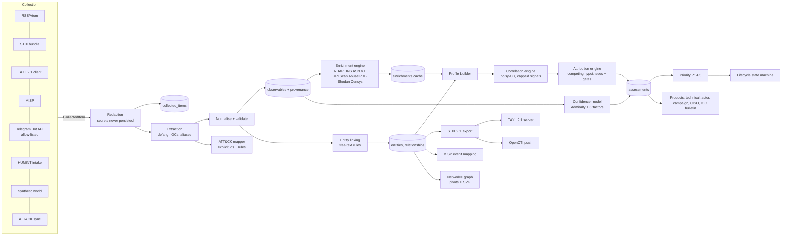

# Architecture

THREATINTEL-X is a modular monolith in Python 3.12: one process serves the REST API, the TAXII 2.1
server and the analyst workbench; a CLI drives the same workflows. Our own data model and analysis
pipeline are the core — MISP, OpenCTI and TAXII are integrations at the edge.

## Component view

## Layers and modules

| Layer | Module(s) | Responsibility |
|---|---|---|
| Models | `models/` | Pydantic domain model mirroring STIX SDOs; `Provenance`, `Evidence`, `Assessment` |
| Storage | `storage/db.py`, `storage/repository.py` | SQLAlchemy 2.0 schema; the only SQL in the codebase |
| Collection | `collectors/` | One interface, many sources; output is always `CollectedItem` |
| Processing | `extraction/`, `attack/`, `enrichment/` | Redaction, extraction, normalisation, validation, ATT&CK, enrichment |
| Analysis | `analysis/` | Confidence, correlation, profiles, attribution, priority, lifecycle, IR answers |
| Orchestration | `pipeline.py`, `workflows.py`, `platform.py` | Deterministic per-item pipeline; composition root |
| Dissemination | `stix/`, `api/taxii.py`, `integrations/`, `reporting/` | STIX, TAXII, MISP, OpenCTI, products |
| Interfaces | `api/app.py`, `web/`, `cli.py` | REST, workbench, CLI |
| Guardrails | `net.py`, `api/security.py`, `llm/boundary.py` | SSRF guard, auth/CSP/CSRF, LLM boundary |

## Pipeline (per collected item)

1. **Redact** secrets (combos, key=value, cloud/API tokens, JWTs, private keys) → accounts + keyed fingerprints only.
2. **Store raw** (dedup on source + content hash) → lifecycle `NEW`.
3. **Extract** IOCs (defang-aware; URLs/emails masked before domains; ambiguous file-extension TLDs rejected
   unless defanged) and named entities (alias dictionary from the KB) → `TRIAGED`.
4. **Validate** (TLD list, routability, documentation ranges, empty-file hashes, unknown ATT&CK ids) and upsert
   observables with provenance.
5. **Link** entities using conservative free-text rules; single-actor co-mention = *reported* attribution claim.
6. **Map ATT&CK** (explicit ids > curated keyword rules, all validated against the loaded release).
7. **Enrich** actionable observables (cached, rate-limited, retried; derived resolves-to / belongs-to / NS links) → `ENRICHING`.
8. **Correlate** against campaign profiles → `CORRELATED`.
9. **Attribute** against all actor profiles (competing hypotheses) — only if technical indicators exist.
10. **Confidence** per observable and per item; **priority** per item.
11. **Lifecycle**: P1/P2 or credential exposure → `UNDER_REVIEW` (analyst queue, IR-008).

Campaign-level attribution is re-assessed after ingest with leave-one-out actor profiles and persisted
only after all campaigns are scored (order-independent).

## Data flow guarantees

- **Idempotent**: uuid5 ids everywhere; re-running the demo adds nothing.
- **Provenance**: every observable, entity and relationship links to the item + source that produced it.
- **No circular reporting**: actor profiles use source claims only, never our own `attributed-to`.
- **Offline by default**: `TIX_ONLINE=false`; synthetic enrichment only answers synthetic observables.

## Deployment

Single container (non-root, read-only FS, caps dropped) with SQLite on a volume, or PostgreSQL via
`TIX_DATABASE_URL` (CI runs the full pipeline on PostgreSQL 16). See `docker-compose.yml`.
