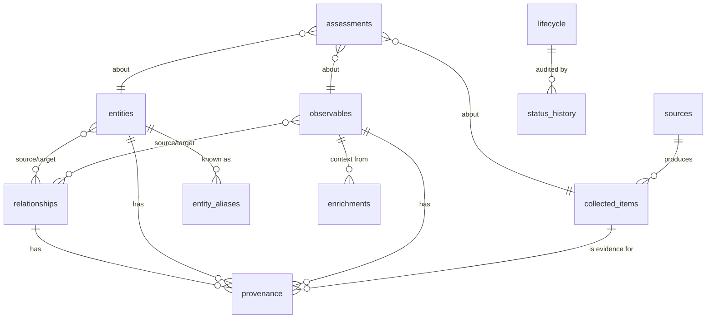

# Data model

| Table | Holds | Key points |
|---|---|---|
| `sources` | who we collect from | reliability A–F, `derived_from`, `internal`, `synthetic` |
| `collected_items` | raw intelligence (post-redaction) | unique (source, content hash); credibility 1–6; statement type |
| `observables` | normalised IOCs | unique (type, value); first/last seen; `actionable`; flags |
| `provenance` | subject ↔ item ↔ source | one row per (subject, source, item) |
| `entities` / `entity_aliases` | actors, campaigns, malware, tools, CVEs | STIX-shaped JSON; alias index feeds extraction |
| `relationships` | typed edges | `reported-attribution` (claim) vs `attributed-to` (ours) |
| `enrichments` | provider results + errors | cache with per-provider TTL |
| `assessments` | confidence / correlation / attribution / priority | score, level, factors, evidence, alternatives, caveats |
| `lifecycle`, `status_history` | workflow state | reviewer + timestamps; full audit trail |
| `records` | IRs, HUMINT, credential exposures, ransomware claims, products | typed JSON documents |

Relationship vocabulary: `indicates`, `uses`, `exploits`, `related-to`, `resolves-to`, `belongs-to`,
`uses-nameserver`, `exhibits-technique`, `reported-attribution`, `attributed-to`.
